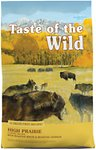

# PERSONAL PROJECT - chewy.com site clone

This is adesktop cloning to the [Chewy.com](https://www.chewy.com/) website, a company selling animal products(foods and toys).

## Table of contents
  - [Links](#links)
  - [Built with](#built-with)
  - [What I learned](#what-i-learned)
  - [Continued development](#continued-development)
  - [Useful resources](#useful-resources)
- [Author](#author)
- [Acknowledgments](#acknowledgments)

### Links

-Github URL: [Add solution URL here](https://your-solution-url.com)
- Live Site URL: [Netlify](https://chewysiteclone.netlify.app/)

### Built with

- Semantic HTML5 markup
- CSS custom properties
- Flexbox
- CSS Grid


### What I learned

I learned about the efficacy of utility classes. This makes my work easier as I only has to reuse them. 

To see how you can add code snippets, see below:

```html
 <div class="section-container">
                <h3>35% Off your Autoship</h3>
                <a href="#">Shop All Autoship</a>
                <i class="fa-solid fa-angle-right easter-icon"></i>
                <div class="discovery-images">
                    <div class="card">
                        <div class="card-image">
                            
                        </div>
                        <div class="card-body">
                            <p><a href="#"><span>Frisco</span> St Patricks box of gold hide and seek puzzle plush squeaky dog toy</a></p>
                            <div class="checkout-white">
                                <p>Spend $100 on select Vet Diet Items. Get a $15 eGift Card</p>
                            </div>
                            <div class="icon-ratings">
                                <i class="fa-solid fa-star"></i>
                                <i class="fa-solid fa-star"></i>
                                <i class="fa-solid fa-star"></i>
                                <i class="fa-solid fa-star"></i>
                                <i class="fa-solid fa-star"></i>
                                <small>3000</small>
                            </div>
                            <strong>$16.98</strong>

                        </div>
                    </div>
```
```css
.pet-images,
.categories-images,
.pupKit-images,
.pharmacy-images,
.brand-images {
    display: flex;
    justify-content: space-between;
}
```

### Continued development

I am still not perfect with the naming convention of CSS classes. Therefore, I will keep learning. Also, I will love to learn how to segregate my CSS codes into different files. In this project, I have only one CSS file which means it is one long thread of codes.


### Useful resources

- [ cdnjs](https://cdnjs.com/libraries/font-awesome) - This helped me for the icons. I really liked this pattern and will use it going forward.
- [google fonts](https://fonts.google.com/specimen/Roboto) - 


## Author

- Website - [codeheph](https://chewysiteclone.netlify.app/)
- Twitter - [@undaunted_pen](https://www.twitter.com/yourusername)


## Acknowledgments

I will love to acknowledge my tutor, Mr Seyi Ojesanmi, who gave this project as an assignment.


